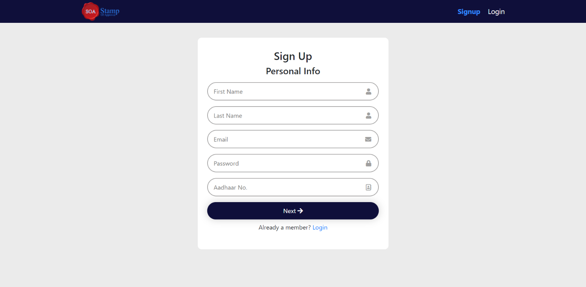
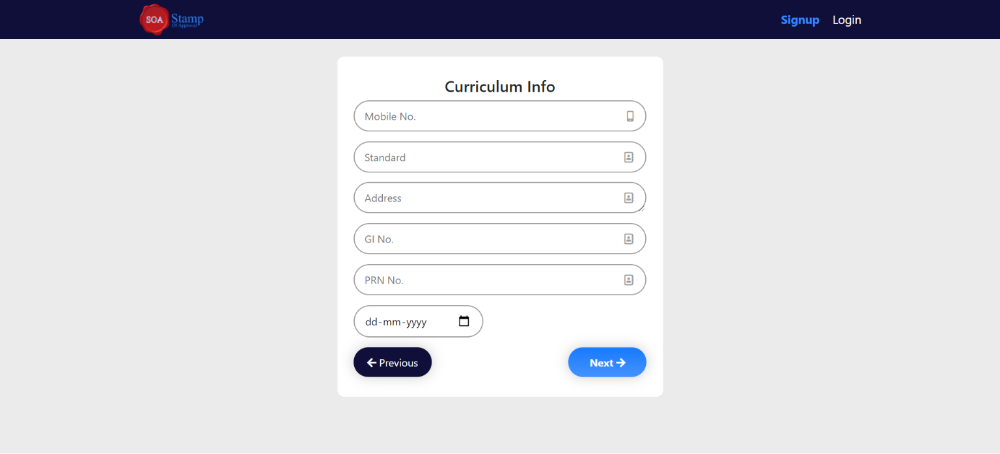
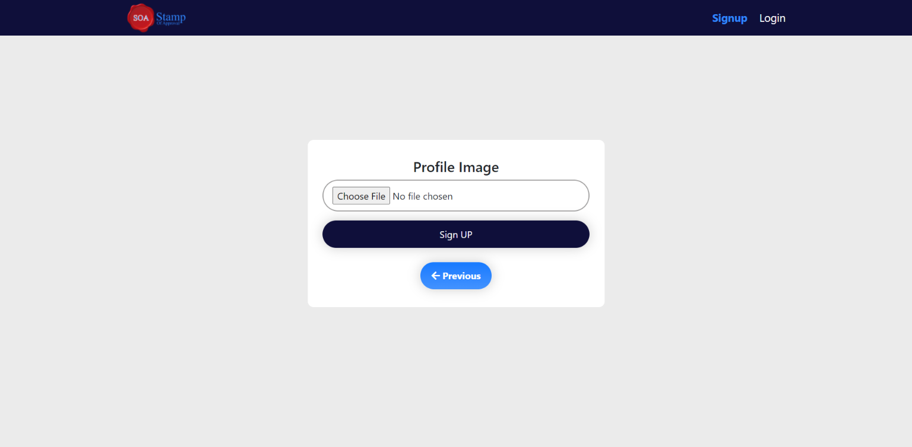
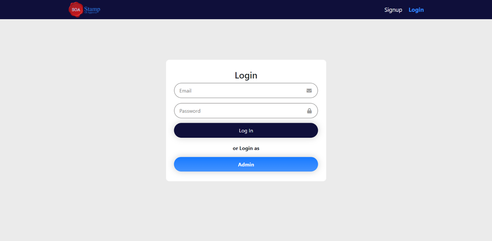
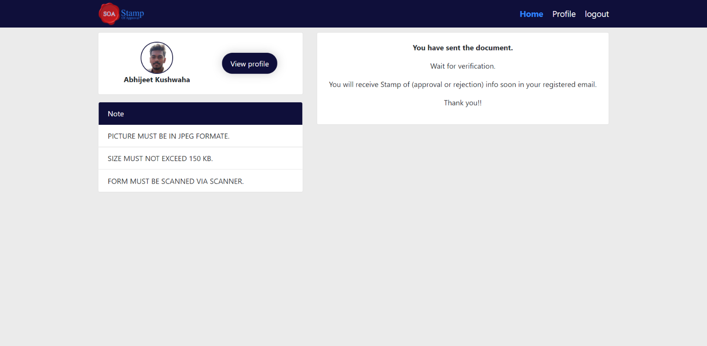

## Stamp Of Approval

    
    
    

Stamp Of Approval

Stamp of Approval is a web-based application, will focus mainly on automating the process of document
submission and verification. In this sense required document will be submitted online, approval or rejection will
be updated on students e-mail online by the Admin

**Project Published on Vercel:** [https://stampofapproval.vercel.app/](https://stampofapproval.vercel.app/)

## Project Screen Shot(s)

### 1. Sign Up Pages
#### Page one
  

#### Page two
  

#### Page three
  

### 2. Login Page
  

### 3. Admin Page.

### 4. Dashboard Page.

## Tecnologies:

- **ReactJS** - JavaScript library that is used for building user interfaces specifically for single-page applications.
- **Firebase** -  Creating Backend for application.
- **Bootstrap** - CSS framework directed at responsive, mobile-first front-end web development.

## Installation and Setup Instructions

Clone down this repository. You will need `node` and `npm` installed globally on your machine.  

Installation:

`npm install`  

To Run Test Suite:  

`npm test`  

To Start Server:

`npm start`  

To Visit App:

`localhost:3000`  

